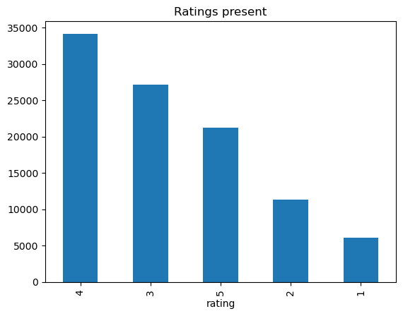
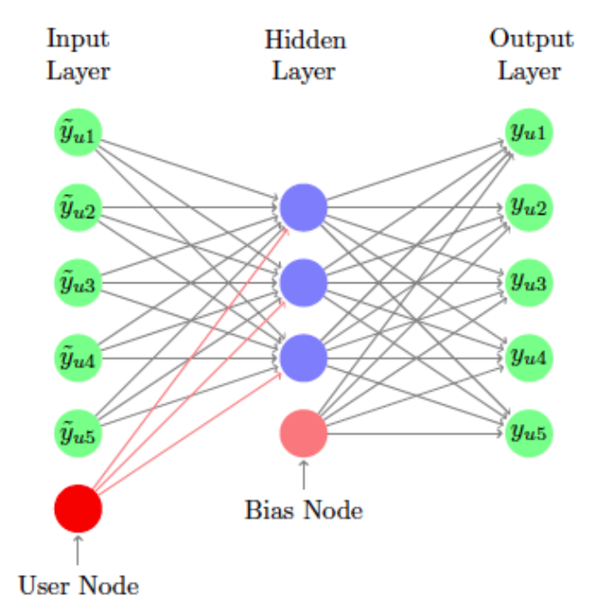
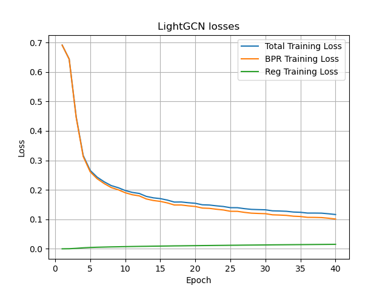
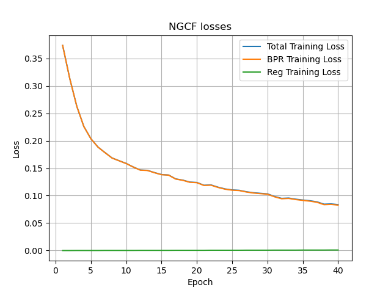
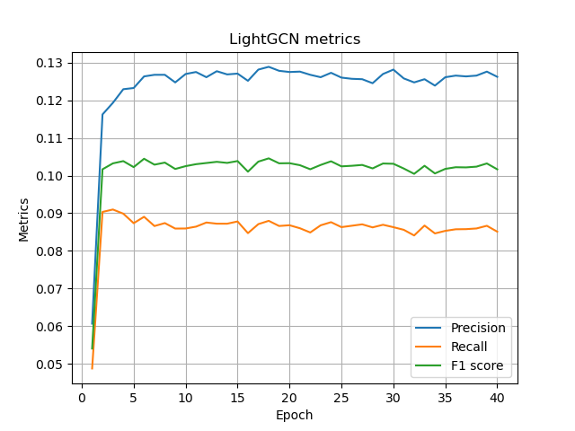
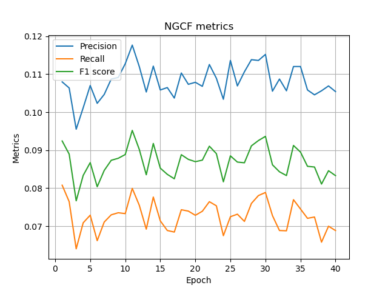
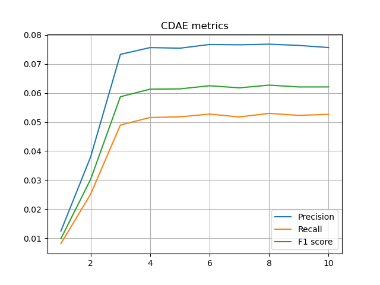

# Final Report - Lev Kozlov - B20-RO

## Introduction

In this assignment I was asked to implement a recommender machine learning model which will suggest item based on user's interest. The dataset for the assignment was [MovieLens 100K](https://grouplens.org/datasets/movielens/100k/) consiting of user ratings to movies.

## Data analysis - [notebook](../notebooks/1.0-exploration.ipynb)

The original dataset consists of 100K samples of user ratings to other movies and many metadata. I was inspired by [this work](https://medium.com/stanford-cs224w/recommender-systems-with-gnns-in-pyg-d8301178e377) when attempted to this assignment and decided to use only information about pairs of `(user, item)`.

It can be seen that there are 943 unique users and 1682 films they had rated. The ratings are ranged from 1 to 5.

Although there is a big number of metadata, I will not use them. My motivation was to copy the work above as baseline and use similar preprocessing steps to the data for easier comparison of results.

Splitting the data into train and test sets with 80-20 shares, I had to ensure that all users from test set are present in train set. Moreover, I applied `LabelEncoder` for both users and items to have unique ascending indices for both of them.

## Metrics - [notebook](../notebooks/2.0-graphing.ipynb)

For recommender system I have decided to use common metrics: `Precision@K`, `Recall@K` and `F1 score@K`.

In the case of films suggestion, precision is the fraction of relevant films among the suggested ones. Recall is the fraction of relevant films that have been suggested (among suggested). F1 score is the harmonic mean of precision and recall.

## Model Implementation

### Baseline - [notebook](../notebooks/3.0-baseline.ipynb)

Study of [this approach](https://medium.com/stanford-cs224w/recommender-systems-with-gnns-in-pyg-d8301178e377) was a part of lab assignment in the course and it shows implementation of graph neural network (GNN) which are assumed good for this task as they can capture the structure of the graph and use it for predictions.

For the baseline I took `LightGCN` and `NGCF` models which use `pyg` library and others. As all conclusions about those libraries were already made by authors, I had to refactor their code and make it work. To tune those models, `BRP` loss is used because it had more meaning.

### Proposed solution

As graph-way was already explored in my baseline, I have decided to try `AutoEncoder` approach, which was implemented in [this work](https://alicezheng.org/papers/wsdm16-cdae.pdf). Also, some insights about its implementation were given [here](https://jameskle.com/writes/rec-sys-part-6).

## Model Advantages and Disadvantages

Comparing two models in baseline and proposed solution, it is clear to say that simplicity of my solution is its advantage. It leverages no need in graph creation which might be time costly. Also, the approach is very naive and simple to implement.

## Training Process

Two models in baseline were trained for 40 epochs with `BRP` loss and `Adam` optimizer.

It worth saying that `LightGCN` can be trained faster due to lesser number of trainable parameters. Moreover, it utilizes `neighbourhood aggregation` which reduces much complexity.

For `CDAE` model I have used `BCEWithLogitsLoss` and `Adam` optimizer. The model was trained for 10 epochs only, but reached its peak performance at 4th epoch already.

## Evaluation

Below are the losses during traing process for all models and how they evolve though epochs.

An important note can be made that `CDAE` and `LightGCN` improve their performance up to some extent and then overfit, `NGCF` was poorly learning.

The results may vary for `evaluate` script, because for training I have removed influence of train dataframe during loss calculation.

After evaluation using `python3 benchmark/evaluate.py` we can see the following results:

| Metrics  | Precision | Recall | F1     |
| -------- | --------- | ------ | ------ |
| LightGCN | 0.0767    | 0.0554 | 0.0643 |
| NGCF     | 0.06      | 0.0413 | 0.0489 |
| CDAE     | 0.0756    | 0.0526 | 0.0621 |

## Results

As wee see from evaluation of models, `CDAE` model performs satisfactory and trains faster than graph-based networks. I doubt that it is scalable enough solution as it would be better to consider metadata and increase the complexity of underlying context of the model. However, it was a good experience to implement much simplier model in order to compare it with more complex ones.
